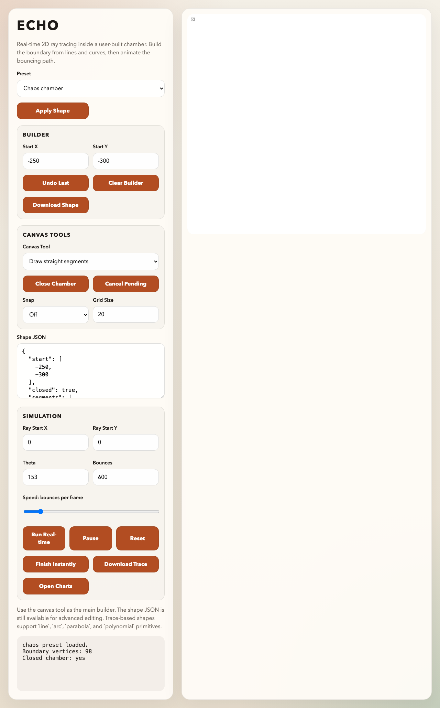
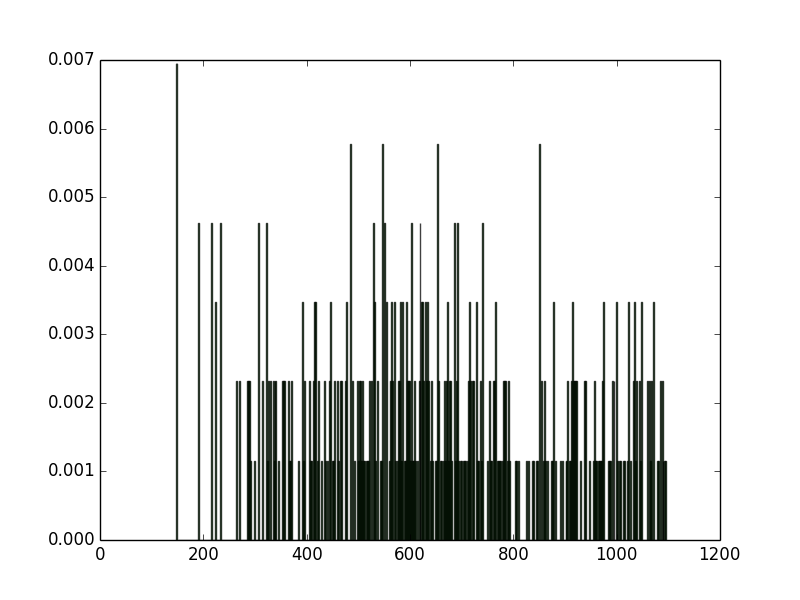

## ECHO

ECHO is a 2D reverberation chamber study tool based on simple ray tracing. The current goal is not full electromagnetic fidelity. The goal is to study chamber geometry, chaotic behavior, bounce statistics, and qualitative spectral structure with a lightweight 2D model first. Full EM or higher-fidelity methods can be added later once the geometry and analysis workflow are better understood.

The project started from two chamber types:

1. A rectangular chamber
2. A chaotic chamber based on opposing semicircular boundaries

It now supports more general 2D chambers defined as:

1. Raw polygon vertices
2. Trace-built shapes composed of `line`, `arc`, `parabola`, and `polynomial` primitives

This lets you prototype and compare candidate chamber boundaries quickly in either Python or the browser.

Reference for the original 2D chaotic chamber idea:

Nicola Pasquino, "Chaotic Model of a New Reverberation Enclosure for EMC Compliance Testing in the Time Domain", IMTC 2004, Como, Italy, May 2004.

**Current Scope**

ECHO currently focuses on:

1. 2D specular ray bouncing inside a closed chamber
2. Exact circular-arc reflections for arc boundaries
3. Real-time trace visualization
4. Trace logging
5. Histogram analysis of bounce lengths
6. Spectrum analysis of the ordered bounce-length sequence
7. Fast geometry iteration for chaotic and non-chaotic chamber ideas

ECHO does not currently attempt:

1. Full-wave EM simulation
2. Mode solving
3. Material loss modeling
4. 3D chamber simulation

**Requirements**

1. Python 3.x
2. `matplotlib`

`sim.py` can run headless if your Python build does not include `tkinter`/`turtle`.

**Setup**

```bash
git clone https://github.com/antopenrf/ECHO.git
cd ECHO
python3 -m venv .venv
.venv/bin/python -m pip install -r requirements.txt
```

**Python Workflow**

Run the built-in chamber examples:

```bash
.venv/bin/python sim.py input_chaos.sim
.venv/bin/python sim.py input_rect.sim
.venv/bin/python sim.py input_polygon.sim
.venv/bin/python sim.py input_trace.sim
```

Run the analyzer on a saved trace:

```bash
.venv/bin/python analyze.py results_demo_chaos.txt
```

The analysis now generates:

1. `basename.png` for the bounce-length histogram
2. `basename_spectrum.png` for the normalized bounce-length spectrum
3. `basename_spectrum.txt` for the spectrum table

**Simulation Inputs**

The `.sim` files support:

1. `type`: `chaos`, `rectangular`, or `polygon`
2. `dim`: required for `chaos` and `rectangular`
3. `p0`: initial particle position
4. `theta0`: initial heading direction
5. `times`: number of bounces
6. `display`: print trace progress in the terminal
7. `log`: save the trace to a text file
8. `draw`: draw the path if `turtle` is available
9. `filename`: output basename
10. `shape_file`: required for `type polygon`

For `type polygon`, the shape file can be either:

1. A raw vertex list or object with `vertices`
2. A trace specification with `start`, `segments`, and `closed`

Example polygon shape:

```json
{
  "vertices": [
    [-420, -220],
    [360, -260],
    [520, 40],
    [180, 300],
    [-120, 260],
    [-500, 60]
  ]
}
```

Example trace-built shape:

```json
{
  "start": [-260, -280],
  "closed": true,
  "segments": [
    { "type": "line", "to": [220, -280] },
    { "type": "arc", "center": [220, 0], "radius": 280, "end_angle": 90, "segments": 32 },
    { "type": "line", "to": [-180, 280] },
    { "type": "parabola", "control": [-420, 40], "to": [-260, -280], "segments": 36 }
  ]
}
```

Supported trace segment types:

1. `line`
2. `arc`
3. `parabola`
4. `polynomial`

**Browser Workflow**

Serve the repo locally, for example on a non-conflicting port:

```bash
cd /Users/yulung/codes/ECHO
python3 -m http.server 8001
```

Then open:

`http://localhost:8001/web/index.html`

The browser UI supports:

1. Real-time ray animation
2. Preset chamber loading
3. Simplified canvas-first chamber construction
4. Direct canvas drawing for lines, arcs, and parabolas
5. Full JSON editing of the chamber definition when needed
6. Trace download
7. One-click histogram and spectrum charts in a separate HTML page

**Screenshots**

Interactive browser simulator:



Example bounce-length histogram:



Example normalized bounce-length spectrum:


**Why 2D First**

This repo is intentionally biased toward fast chamber exploration instead of high-fidelity physics. The idea is:

1. Start with simple 2D ray tracing
2. Compare regular and chaotic chamber behavior quickly
3. Study trace distributions and spectral signatures
4. Use those results to decide which geometries are worth carrying into more expensive EM work later

That makes ECHO a geometry and intuition-building tool first, and a full EM tool later if the study justifies it.
